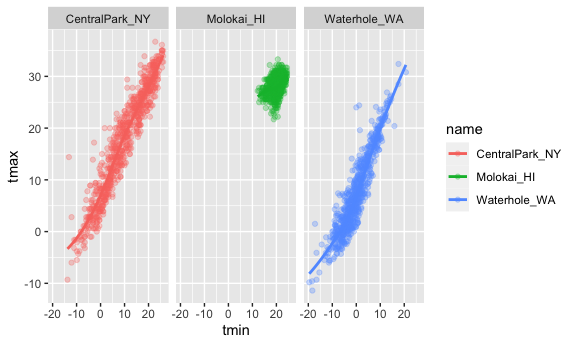
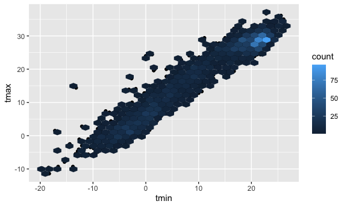
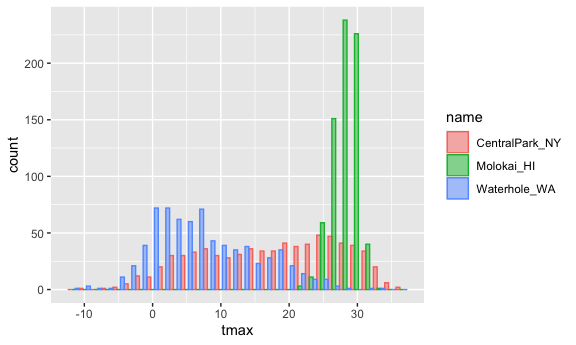

Data viz: ggplot 1
================

Load all necessary pacakges.

``` r
library(tidyverse)
library(ggridges)

knitr::opts_chunk$set(
  fig.width = 6,
  fig.asp = 0.6,
  out.width = "90%"
)
```

Get the data for plotting today.

``` r
# Pull 3 weather stations from NOAA dataset
df_weather = 
  rnoaa::meteo_pull_monitors(
    c("USW00094728", "USW00022534", "USS0023B17S"),
    var = c("PRCP", "TMIN", "TMAX"), 
    date_min = "2021-01-01",
    date_max = "2022-12-31") |>
# Rename and clean variables
  mutate(
    name = recode(
      id, 
      USW00094728 = "CentralPark_NY", 
      USW00022534 = "Molokai_HI",
      USS0023B17S = "Waterhole_WA"),
    tmin = tmin / 10,
    tmax = tmax / 10) |>
  select(name, id, everything())
```

    ## using cached file: /Users/Derek/Library/Caches/org.R-project.R/R/rnoaa/noaa_ghcnd/USW00094728.dly

    ## date created (size, mb): 2023-09-28 10:20:09.047204 (8.524)

    ## file min/max dates: 1869-01-01 / 2023-09-30

    ## using cached file: /Users/Derek/Library/Caches/org.R-project.R/R/rnoaa/noaa_ghcnd/USW00022534.dly

    ## date created (size, mb): 2023-09-28 10:20:15.065928 (3.83)

    ## file min/max dates: 1949-10-01 / 2023-09-30

    ## using cached file: /Users/Derek/Library/Caches/org.R-project.R/R/rnoaa/noaa_ghcnd/USS0023B17S.dly

    ## date created (size, mb): 2023-09-28 10:20:17.264748 (0.994)

    ## file min/max dates: 1999-09-01 / 2023-09-30

Let’s make a plot!

``` r
ggplot(df_weather, aes(x = tmin, y = tmax)) +
  geom_point()
```

    ## Warning: Removed 17 rows containing missing values (`geom_point()`).


Pipes and stuff

``` r
ggp_nyc_weather <- 
  df_weather |> 
    filter(name == "CentralPark_NY") |> 
    ggplot(aes(x = tmin, y = tmax)) +
    geom_point()

ggp_nyc_weather
```


## Fancy plot

``` r
ggplot(df_weather, aes(x = tmin, y = tmax)) +
  geom_point(aes(color = name), alpha = 0.3) +
  geom_smooth(se = FALSE)
```

    ## `geom_smooth()` using method = 'gam' and formula = 'y ~ s(x, bs = "cs")'

    ## Warning: Removed 17 rows containing non-finite values (`stat_smooth()`).

    ## Warning: Removed 17 rows containing missing values (`geom_point()`).


Plot with facets

``` r
ggplot(df_weather, aes(x = tmin, y = tmax, color = name)) +
  geom_point(alpha = 0.3) +
  geom_smooth(se = FALSE) +
  facet_grid(. ~ name)
```

    ## `geom_smooth()` using method = 'loess' and formula = 'y ~ x'

    ## Warning: Removed 17 rows containing non-finite values (`stat_smooth()`).

    ## Warning: Removed 17 rows containing missing values (`geom_point()`).



Let’s try a different plot. temps are boring

``` r
ggplot(df_weather, aes(x = date, y = tmax, color = name)) +
  geom_point(aes(size = prcp), alpha = 0.3) +
  geom_smooth(se = 0) + 
  facet_grid(. ~ name)
```

    ## `geom_smooth()` using method = 'loess' and formula = 'y ~ x'

    ## Warning: Removed 17 rows containing non-finite values (`stat_smooth()`).

    ## Warning: Removed 19 rows containing missing values (`geom_point()`).


Try assigning specfic colors

``` r
df_weather |> 
  filter(name != "CentralPark_NY") |> 
  ggplot(aes(x = date, y = tmax, color = name)) +
  geom_point(alpha = 0.7, size = 0.5) 
```

    ## Warning: Removed 17 rows containing missing values (`geom_point()`).


``` r
#gives density in hex cells
ggplot(df_weather, aes(x = tmin, y = tmax)) +
  geom_point() +
  geom_hex()
```

    ## Warning: Removed 17 rows containing non-finite values (`stat_binhex()`).

    ## Warning: Removed 17 rows containing missing values (`geom_point()`).



``` r
df_weather |> 
  filter(name == "Molokai_HI") |> 
  ggplot(aes(x = date, y = tmax)) +
  geom_line(alpha = 0.5) + 
  geom_point(alpha = 0.5)
```

    ## Warning: Removed 1 rows containing missing values (`geom_point()`).


## Univariate plots

Histogram

``` r
ggplot(df_weather, aes(x = tmax, color = name, fill = name)) +
  geom_histogram(position = "dodge", alpha = 0.5)
```

    ## `stat_bin()` using `bins = 30`. Pick better value with `binwidth`.

    ## Warning: Removed 17 rows containing non-finite values (`stat_bin()`).



`dodge` works but it makes things hard to read. Instead, let’s use a
density plot.

``` r
ggplot(df_weather, aes(x = tmax, fill = name)) +
  geom_density(alpha = 0.5)
```

    ## Warning: Removed 17 rows containing non-finite values (`stat_density()`).


Boxplots!

``` r
ggplot(df_weather, aes(y = tmax, x = name)) + 
  geom_boxplot()
```

    ## Warning: Removed 17 rows containing non-finite values (`stat_boxplot()`).


Violin plots. Don’t use them kids.

``` r
ggplot(df_weather, aes(y = tmax, x = name)) + 
  geom_violin()
```

    ## Warning: Removed 17 rows containing non-finite values (`stat_ydensity()`).


Ridge plot. The hottest new thing.

``` r
ggplot(df_weather, aes(x = tmax, y = name)) + 
  geom_density_ridges() 
```

    ## Picking joint bandwidth of 1.54

    ## Warning: Removed 17 rows containing non-finite values
    ## (`stat_density_ridges()`).


## Saving and embedding plots

``` r
ggp_weather <- 
  df_weather |> 
    ggplot(aes(x = tmin, y = tmax)) +
    geom_point()

ggp_weather
```

    ## Warning: Removed 17 rows containing missing values (`geom_point()`).


``` r
# save
ggsave("results/ggp_weather.pdf", ggp_weather)
```

    ## Saving 6 x 3.6 in image

    ## Warning: Removed 17 rows containing missing values (`geom_point()`).

``` r
ggp_weather
```

    ## Warning: Removed 17 rows containing missing values (`geom_point()`).


