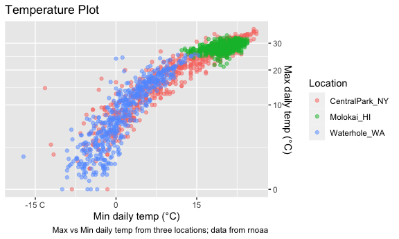
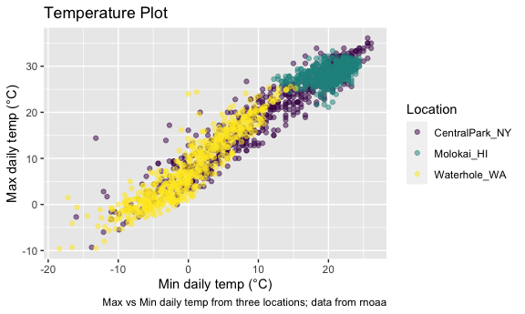
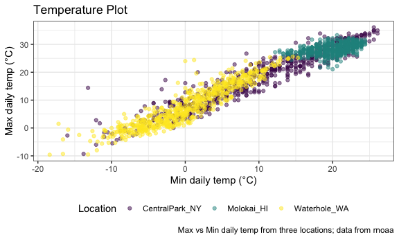
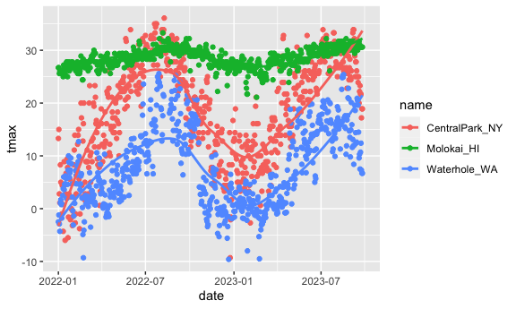
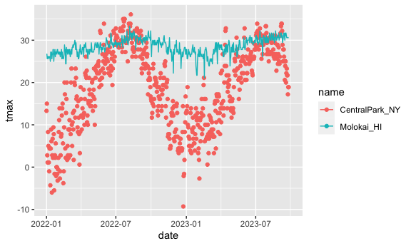
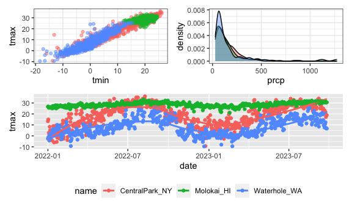

Data viz: ggplot 2
================
Derek Lamb
2023-10-03

Load all necessary pacakges.

``` r
library(tidyverse)
library(patchwork)

knitr::opts_chunk$set(
  fig.width = 6,
  fig.asp = 0.6,
  out.width = "90%"
)
```

## Data Import

Get the data for plotting today.

``` r
# Pull 3 weather stations from NOAA dataset
df_weather = 
  rnoaa::meteo_pull_monitors(
    c("USW00094728", "USW00022534", "USS0023B17S"),
    var = c("PRCP", "TMIN", "TMAX"), 
    date_min = "2022-01-01",
    date_max = "2023-12-31") |>
# Rename and clean variables
  mutate(
    name = recode(
      id, 
      USW00094728 = "CentralPark_NY", 
      USW00022534 = "Molokai_HI",
      USS0023B17S = "Waterhole_WA"),
    tmin = tmin / 10,
    tmax = tmax / 10) |>
  select(name, id, everything())
```

    ## using cached file: /Users/Derek/Library/Caches/org.R-project.R/R/rnoaa/noaa_ghcnd/USW00094728.dly

    ## date created (size, mb): 2023-09-28 10:20:09.047204 (8.524)

    ## file min/max dates: 1869-01-01 / 2023-09-30

    ## using cached file: /Users/Derek/Library/Caches/org.R-project.R/R/rnoaa/noaa_ghcnd/USW00022534.dly

    ## date created (size, mb): 2023-09-28 10:20:15.065928 (3.83)

    ## file min/max dates: 1949-10-01 / 2023-09-30

    ## using cached file: /Users/Derek/Library/Caches/org.R-project.R/R/rnoaa/noaa_ghcnd/USS0023B17S.dly

    ## date created (size, mb): 2023-09-28 10:20:17.264748 (0.994)

    ## file min/max dates: 1999-09-01 / 2023-09-30

This results in a dataframe with 1914 observations on six variables. \##
Labs

``` r
df_weather |> 
  ggplot(aes(x = tmin, y = tmax, color = name)) +
  geom_point(alpha = 0.5) +
  labs(
    title = "Temperature Plot",
    x = "Min daily temp (°C)",
    y = "Max daily temp (°C)",
    color = "Location",
    caption = "Max vs Min daily temp from three locations; data from rnoaa"
  )
```

    ## Warning: Removed 30 rows containing missing values (`geom_point()`).


## Scales & Colors

``` r
df_weather |> 
  ggplot(aes(x = tmin, y = tmax, color = name)) +
  geom_point(alpha = 0.5) +
  labs(
    title = "Temperature Plot",
    x = "Min daily temp (°C)",
    y = "Max daily temp (°C)",
    color = "Location",
    caption = "Max vs Min daily temp from three locations; data from rnoaa"
  ) + 
  scale_x_continuous(
    breaks = c(-15,0,15),
    labels = c("-15 C", "0", "15")
  ) +
  scale_y_continuous(
    position = "right",
    trans = "sqrt"
  )
```

    ## Warning in self$trans$transform(x): NaNs produced

    ## Warning: Transformation introduced infinite values in continuous y-axis

    ## Warning: Removed 135 rows containing missing values (`geom_point()`).



What about colors…

``` r
df_weather |> 
  ggplot(aes(x = tmin, y = tmax, color = name)) +
  geom_point(alpha = 0.5) +
  labs(
    title = "Temperature Plot",
    x = "Min daily temp (°C)",
    y = "Max daily temp (°C)",
    color = "Location",
    caption = "Max vs Min daily temp from three locations; data from rnoaa"
  ) +
  scale_color_viridis_d()
```

    ## Warning: Removed 30 rows containing missing values (`geom_point()`).



## Themes

``` r
df_weather |> 
  ggplot(aes(x = tmin, y = tmax, color = name)) +
  geom_point(alpha = 0.5) +
  labs(
    title = "Temperature Plot",
    x = "Min daily temp (°C)",
    y = "Max daily temp (°C)",
    color = "Location",
    caption = "Max vs Min daily temp from three locations; data from rnoaa"
  ) +
  scale_color_viridis_d() +
  theme_bw() +
  theme(legend.position = "bottom") 
```

    ## Warning: Removed 30 rows containing missing values (`geom_point()`).



## Data argument

``` r
df_weather |> 
  ggplot(aes(x = date, y = tmax,color = name)) +
  geom_point() +
  geom_smooth(se = FALSE)
```

    ## `geom_smooth()` using method = 'loess' and formula = 'y ~ x'

    ## Warning: Removed 30 rows containing non-finite values (`stat_smooth()`).

    ## Warning: Removed 30 rows containing missing values (`geom_point()`).



``` r
df_nyc_weather <- 
  df_weather |> 
  filter(name == "CentralPark_NY")

df_hawaii_weather <- 
  df_weather |> 
  filter(name == "Molokai_HI")

ggplot(df_nyc_weather, aes(x = date, y = tmax, color = name)) +
  geom_point() + 
  geom_line(data = df_hawaii_weather)
```

    ## Warning: Removed 5 rows containing missing values (`geom_point()`).

    ## Warning: Removed 5 rows containing missing values (`geom_line()`).



## `patchwork`

Compare

``` r
df_weather |> 
  ggplot(aes(x = date, y = tmax, color = name)) +
  geom_point() +
  theme_classic() +
  facet_grid(. ~ name)
```

    ## Warning: Removed 30 rows containing missing values (`geom_point()`).


``` r
ggp_temp_scatter <- 
  df_weather |> 
  ggplot(aes(x = tmin, y = tmax, color = name)) +
  geom_point(alpha = 0.5) +
  theme_bw() +
  theme(legend.position = "none")

ggp_prcp_density <- 
  df_weather |>
  filter(prcp > 25) |> 
  ggplot(aes(x = prcp, fill = name)) +
  geom_density(alpha = 0.4) +
  theme_bw() +
  theme(legend.position = "none")

ggp_tmax_date = 
  df_weather |> 
  ggplot(aes(x = date, y = tmax, color = name)) +
  geom_point() +
  geom_smooth(se = 0) +
  theme(legend.position = "bottom")

(ggp_temp_scatter + ggp_prcp_density) /ggp_tmax_date
```

    ## Warning: Removed 30 rows containing missing values (`geom_point()`).

    ## `geom_smooth()` using method = 'loess' and formula = 'y ~ x'

    ## Warning: Removed 30 rows containing non-finite values (`stat_smooth()`).
    ## Removed 30 rows containing missing values (`geom_point()`).



## Data manipulation

``` r
# Reorder characters as factors by hand
df_weather |> 
  mutate(
    name = fct_relevel(name, c("Molokai_HI", "CentralPark_NY", "Waterhole_WA"))) |> 
  ggplot(aes(x = name, y = tmax)) + 
  geom_boxplot()
```

    ## Warning: Removed 30 rows containing non-finite values (`stat_boxplot()`).


``` r
# Reorder character as factors by avg. level of another variable
df_weather |> 
  mutate(
    name = fct_reorder(name, tmax)) |> 
    ggplot(aes(x = name, y = tmax)) + 
  geom_boxplot()
```

    ## Warning: There was 1 warning in `mutate()`.
    ## ℹ In argument: `name = fct_reorder(name, tmax)`.
    ## Caused by warning:
    ## ! `fct_reorder()` removing 30 missing values.
    ## ℹ Use `.na_rm = TRUE` to silence this message.
    ## ℹ Use `.na_rm = FALSE` to preserve NAs.
    ## Removed 30 rows containing non-finite values (`stat_boxplot()`).


## Hard Problem: FAS data

``` r
df_litters <- read_csv("data/FAS_litters.csv") |> 
  janitor::clean_names() |> 
  separate(group, into = c("dose", "day_of_tx"), sep = 3)
```

    ## Rows: 49 Columns: 8
    ## ── Column specification ────────────────────────────────────────────────────────
    ## Delimiter: ","
    ## chr (2): Group, Litter Number
    ## dbl (6): GD0 weight, GD18 weight, GD of Birth, Pups born alive, Pups dead @ ...
    ## 
    ## ℹ Use `spec()` to retrieve the full column specification for this data.
    ## ℹ Specify the column types or set `show_col_types = FALSE` to quiet this message.

``` r
df_pups <- read_csv("data/FAS_pups.csv") |> 
  janitor::clean_names() |> 
  mutate(sex = case_match(sex,
    2 ~ "Male",
    1 ~ "Female"
  ))
```

    ## Rows: 313 Columns: 6
    ## ── Column specification ────────────────────────────────────────────────────────
    ## Delimiter: ","
    ## chr (1): Litter Number
    ## dbl (5): Sex, PD ears, PD eyes, PD pivot, PD walk
    ## 
    ## ℹ Use `spec()` to retrieve the full column specification for this data.
    ## ℹ Specify the column types or set `show_col_types = FALSE` to quiet this message.

``` r
df_fas <- left_join(df_litters, df_pups, by = "litter_number")

df_fas |> 
  select(dose, day_of_tx, starts_with("pd")) |> 
  pivot_longer(
    pd_ears:pd_walk,
    names_to = "outcome",
    values_to = "pn_day"
  ) |> 
  mutate(outcome = fct_reorder(outcome, pn_day, median)) |> 
  drop_na() |> 
  ggplot(aes(x = dose, y = pn_day)) +
  geom_boxplot() +
  theme_bw() +
  facet_grid(day_of_tx ~ outcome)
```

    ## Warning: There was 1 warning in `mutate()`.
    ## ℹ In argument: `outcome = fct_reorder(outcome, pn_day, median)`.
    ## Caused by warning:
    ## ! `fct_reorder()` removing 50 missing values.
    ## ℹ Use `.na_rm = TRUE` to silence this message.
    ## ℹ Use `.na_rm = FALSE` to preserve NAs.


